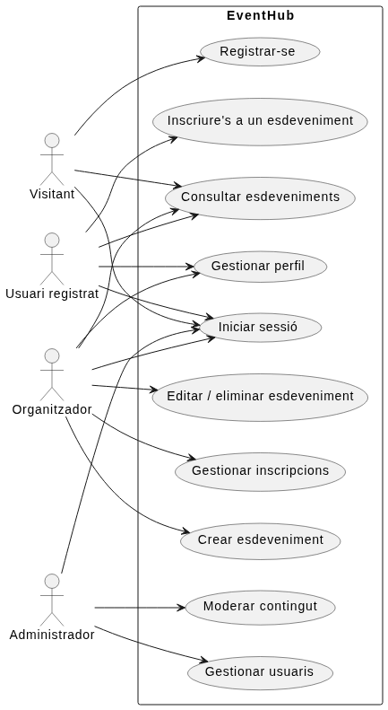
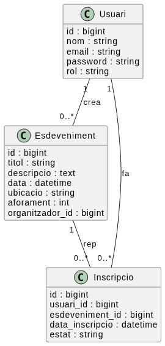
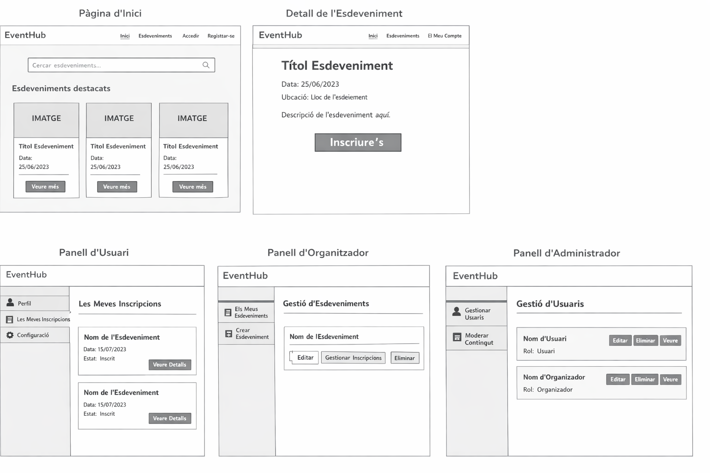
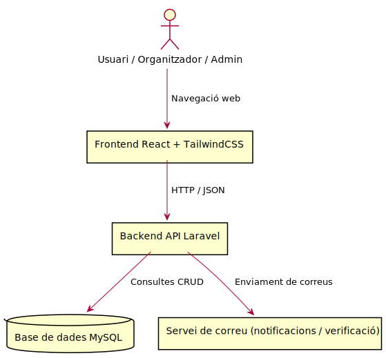

# Exemple complet d'estudi previ (model ideal resumit)

Aquest exemple mostra com podria ser un **estudi previ complet però curt (1‑2 pàgines)**.

---

## 1. Descripció del sistema

**Nom del projecte:** EventHub

**Idea:**

EventHub és una aplicació web que permet descobrir, publicar i gestionar esdeveniments locals (concerts, tallers, activitats culturals, etc.).

Els organitzadors poden crear esdeveniments i gestionar inscripcions, mentre que els usuaris poden cercar activitats per ciutat, data o categoria.

L'objectiu és facilitar la difusió d'activitats locals i millorar la participació ciutadana.

---

## 2. Requisits del sistema
### Requisits funcionals

| Codi | Descripció                                  |
| ---- | ------------------------------------------- |
| RF1  | Registrar usuaris                           |
| RF2  | Iniciar sessió                              |
| RF3  | Crear esdeveniments                         |
| RF4  | Cercar esdeveniments per categoria o ciutat |
| RF5  | Inscriure's a un esdeveniment               |
| RF6  | Gestionar inscripcions                      |
| RF7  | Administrar usuaris                         |

---

### Requisits no funcionals

| Categoria      | Requisit                                       |
| -------------- | ---------------------------------------------- |
| Seguretat      | Autenticació segura i contrasenyes encriptades |
| Rendiment      | Resposta de l'API inferior a 2 segons          |
| Usabilitat     | Interfície responsive                          |
| Disponibilitat | Disponibilitat mínima del 99%                  |

---

## 4. Model de negoci

## Actors del sistema

| Actor            | Accions Principals                         |
| ---------------- | ----------------------------------- |
| Visitant         | Pot consultar esdeveniments públics i registrar-se   |
| Usuari registrat | Pot inscriure's a esdeveniments     |
| Organitzador     | Pot crear i gestionar esdeveniments |
| Administrador    | Modera contingut i gestiona usuaris |

## Diagrama de casos d'ús 

### Lectura ràpida del diagrama

- **Visitant**: pot consultar esdeveniments i crear un compte.
- **Usuari registrat**: pot iniciar sessió, gestionar el seu perfil i inscriure's a esdeveniments.
- **Organitzador**: a més de les funcionalitats bàsiques, pot crear i gestionar esdeveniments i controlar les inscripcions.
- **Administrador**: s'encarrega de moderar contingut i gestionar usuaris.

Aquest diagrama es pot adaptar fàcilment a altres temàtiques canviant actors i casos d'ús principals.
## 3. Model conceptual (simplificat)

### Entitats principals:

Usuari

- id
- nom
- email
- rol

Esdeveniment

- id
- titol
- data
- ubicacio

Inscripcio

- id
- usuari\_id
- esdeveniment\_id

Relacions:

Usuari (1) —— (N) Inscripcio (N) —— (1) Esdeveniment
### Model de dades

### Lectura ràpida del model de dades

- Usuari representa qualsevol persona registrada al sistema.
- Un usuari organitzador pot crear diversos esdeveniments.
- Un usuari registrat es pot inscriure a diversos esdeveniments.
- La taula Inscripcio resol la relació entre usuaris i esdeveniments i permet guardar informació pròpia de la inscripció.

---

## 5. Disseny inicial de la interfície (bàsic)

Pantalles principals:

- Pàgina d'inici (llista d'esdeveniments)
- Detall d'esdeveniment
- Panells d'usuaris
- Formulari de creació
- Formularia de login
  
Exemple: 

---

## 6. Tecnologies utilitzades

Frontend

- React
- TailwindCSS

Backend

- Laravel
- API REST

Base de dades

- MySQL

### Diagrama d'arquitectura 

Aquest esquema mostra una arquitectura web típica per a l'exemple proposat.

### Lectura ràpida de l'arquitectura
- L'usuari accedeix a una interfície web desenvolupada amb React.
- El frontend consumeix una API REST implementada amb Laravel.
- El backend gestiona la lògica de negoci, l'autenticació, els rols i l'accés a dades.
- La informació es desa en una base de dades MySQL.
- Determinades accions poden generar correus o notificacions.

---

## 7. Planificació inicial

| Fase | Descripció   |
| ---- | ------------ |
| 1    | Estudi previ |
| 2    | Backend API  |
| 3    | Frontend     |
| 4    | Integració   |
| 5    | Proves       |
| 6    | Documentació |
| 7    | Desplegament |

---

Aquest nivell de detall és suficient per començar el desenvolupament i demostrar que el projecte està **pensat abans de programar**.

---

